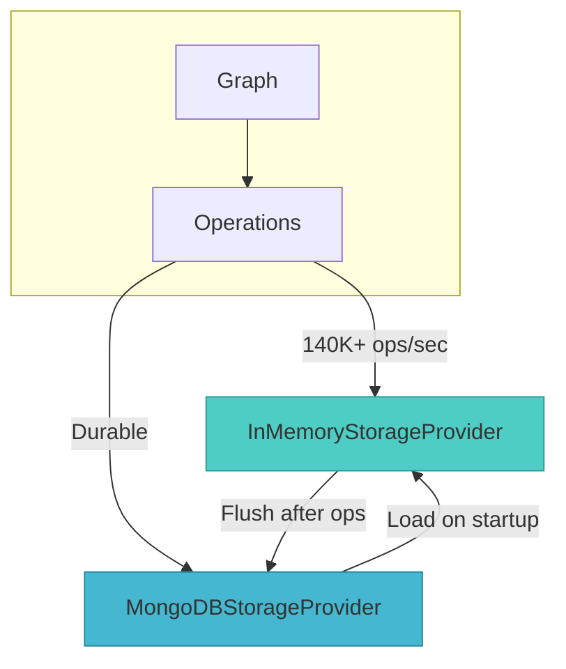
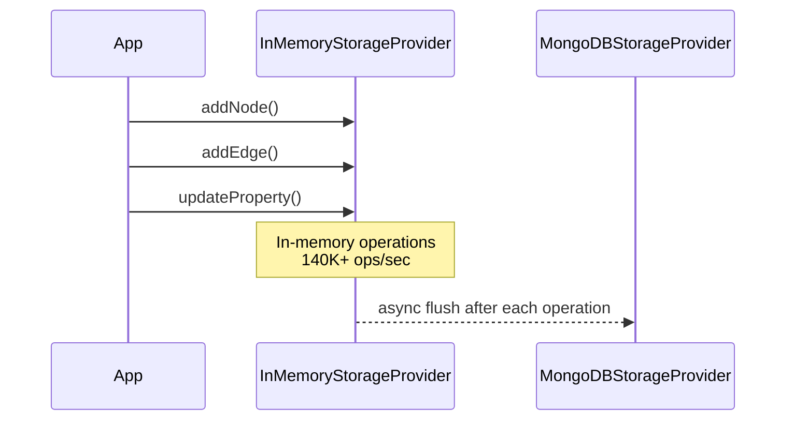
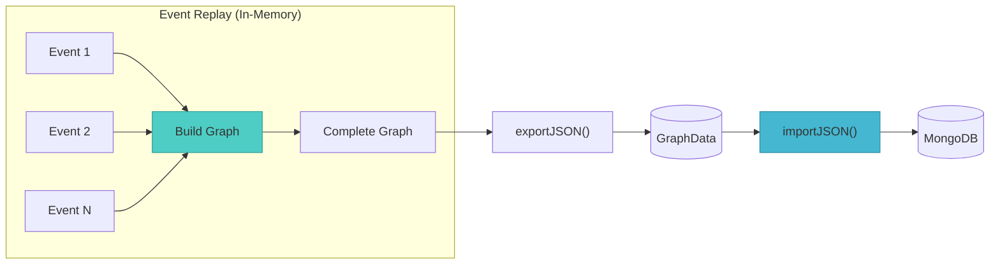

In event-driven architectures, snapshots are a critical mechanism for recovery, auditing, and state reconstruction. Whether you're building a financial ledger, a collaborative editing system, or a real-time analytics platform, the ability to reconstruct your graph at a specific version can mean the difference between seamless recovery and hours of downtime.

But here's the challenge most teams face: when event counts grow into the tens or hundreds of thousands, naive replay strategies become prohibitively expensive. If each event requires a database call to build the state graph, you're looking at thousands of round-trips, each adding latency and load.

This is exactly the problem Grafio's **InMemoryStorageProvider** solves — and when combined with **MongoDBStorageProvider**, it creates a powerful duo for event-based workflows.

<!-- truncate -->

## The Snapshot Problem in Event Sourcing

Event sourcing is elegant in theory: your system is a journal of immutable facts. To reconstruct state, you simply replay events in order. But practice reveals a brutal reality:


As your event store grows, the naive approach crumbles:
- **10,000 events** = 10,000 database round-trips
- **100,000 events** = 100,000 round-trips
- At even 10ms latency per call, you're looking at **1,000 seconds** just for event replay

The root cause? Event processing becomes I/O bound, not compute bound. Your graph reconstruction is bottlenecked by the slowest part of your system — the database.

## The Grafio Duo: In-Memory Speed Meets Persistent Durability

Grafio's storage architecture was designed to solve this exact problem. The key insight: **separate the fast path (operations) from the durable path (persistence)**.



**The Duo Strategy:**

1. **InMemoryStorageProvider**: All high-frequency operations happen here. With [140,000+ operations per second for single node/edge additions](/blog/grafio-in-memory-performance-benchmarks), sub-millisecond reads, and ~2 bytes per node memory footprint, it's built for speed.

2. **MongoDBStorageProvider**: Your persistent, queryable, indexable storage layer. This is where your canonical data lives — safe, durable, and ready for complex queries.

## Day-to-Day Operations: In-Memory First

During normal operations, your workflow is simple:



Every write goes to InMemoryStorageProvider first for maximum throughput. In the background, the final state is flushed to MongoDB for durability. Your application never waits for persistence — it gets the speed of in-memory operations with the safety of persistent storage.

## The Critical Use Case: Event Replay

When you need to rebuild your graph at a specific version — for recovery, auditing, or branching — this is where the duo strategy truly shines.



**The process is elegant:**

1. **Replay events in-memory**: Build your complete graph state in InMemoryStorageProvider. Zero database calls — just pure, fast in-memory operations at 140K+ ops/sec.

2. **Export the snapshot**: Use `exportJSON()` on InMemoryStorageProvider to get the complete graph as a portable `GraphData` object in a single O(n+e) operation.

3. **Persist to MongoDB**: Use `importJSON()` on MongoDBStorageProvider to write the entire graph state in one bulk operation.

The result? What would take **minutes** with naive DB-per-event replay now takes **seconds** with in-memory replay + one-shot persistence.

## Understanding exportJSON() and importJSON()

These methods are the bridge between your in-memory speed and persistent durability.

### exportJSON()

Available on any `IStorageProvider` implementation, `exportJSON()` returns a complete snapshot of your graph as a portable `GraphData` object:

```typescript
const snapshot: GraphData = await inMemoryGraph.exportJSON();
```

**Key characteristics:**
- O(n + e) single-pass operation — no N+1 queries regardless of graph size
- Deep clones all data to ensure immutability
- Works with any storage provider: InMemoryStorageProvider, MongoDBStorageProvider, or others

### importJSON()

Available on any `IStorageProvider` implementation, `importJSON()` loads a complete `GraphData` object into your storage:

```typescript
await mongoGraph.importJSON(snapshot);
```

**Key characteristics:**
- Bulk import in a single operation
- Throws `NodeAlreadyExistsError` if node IDs already exist in the target store

### The GraphData Structure

The `GraphData` interface is your portable graph format:

```typescript
interface GraphData {
  /** Partition key for multi-tenant scenarios */
  graphId?: string;
  /** All nodes in the graph */
  nodes: NodeData[];
  /** All edges in the graph */
  edges: EdgeData[];
}

interface NodeData {
  id: string;
  labels: string[];
  createdOn?: number;
  updatedOn?: number;
  properties: Record<string, unknown>;
}

interface EdgeData {
  id: string;
  sourceId: string;
  targetId: string;
  type: string;
  createdOn?: number;
  updatedOn?: number;
  properties: Record<string, unknown>;
}
```

This self-contained format means you can serialize it, send it over the network, store it in a file, or use it as a message payload — it's completely provider-agnostic.

## Complete Replay Workflow with Safety Backup

Here's a production-ready implementation that includes the crucial backup step:

```typescript
import { Graph, InMemoryStorageProvider } from 'grafio';
import { MongoGraphFactory } from 'grafio-mongo';
import { randomUUID } from 'crypto';

// Setup
const mongoFactory = new MongoGraphFactory(db);
await mongoFactory.ensureIndexes();

// Step 1: In-memory graph for replay operations
const replayGraph = new Graph(
  new InMemoryStorageProvider({ graphId: 'snapshot-v42' })
);

// Step 2: Replay all events in memory (140K+ ops/sec)
for (const event of events) {
  await applyEvent(replayGraph, event);
}

// Step 3: Export complete state from InMemoryStorageProvider
const snapshot = await replayGraph.exportJSON();
console.log(
  `Exported ${snapshot.nodes.length} nodes, ${snapshot.edges.length} edges`
);

// Step 4: Create backup before replacing data in MongoDB
const randomId = randomUUID();
const existingGraph = mongoFactory.forGraph('my-graph');
const backupGraph = mongoFactory.forGraph(`my-graph-${randomId}`);
await backupGraph.importJSON(existingGraph.exportJSON());

// Step 5: Clear existing data and import new snapshot into MongoDB
await existingGraph.clear();
await existingGraph.importJSON(snapshot);
await existingGraph.ensureIndexes();

// Optionally delete the backupGraph after verifying the import
// await backupGraph.clear();

// Step 6: Clean up in-memory graph
await replayGraph.clear();
```

**Why the backup step matters:**

1. **Safety First**: Before replacing your production data with a reconstructed snapshot, you always have a fallback
2. **Atomic Replacement**: The clear → import → rebuild indexes sequence ensures your MongoDB graph is always in a consistent state
3. **Verification Window**: Keep the backup until you've verified the imported data looks correct

## Performance Comparison

The numbers tell the story:

| Approach | 50K Events | 100K Events |
|----------|-----------|-------------|
| **Naive DB Call per Event** | ~50,000 round trips | ~100,000 round trips |
| **InMemory + exportJSON/importJSON** | 1 export + 1 bulk import | 1 export + 1 bulk import |

**Break-even analysis:**
- InMemory replay: ~500ms for 50K operations (based on [performance benchmarks](/blog/grafio-in-memory-performance-benchmarks))
- Naive DB replay: Even at 10ms latency per call = 500+ seconds
- **Speedup: 100x or more**

The gap widens further when you consider:
- Network latency variance in production environments
- Database connection pool contention under high load
- Index maintenance during concurrent writes

## Integration with Grafio's MongoDB Package

The `grafio-mongo` package makes this seamless:

```typescript
import { GraphManager } from 'grafio';
import { MongoGraphFactory } from 'grafio-mongo';

// Enable caching for production reads
GraphManager.init({
  cache: {
    cacheStore: 'in-memory',
    maxNodesCount: 10000,
    maxEdgesCount: 20000,
  }
});

const mongoFactory = new MongoGraphFactory(db);
await mongoFactory.ensureIndexes();

// Create graph - uses caching automatically for reads
const graph = mongoFactory.forGraph('production-graph');
```

This gives you:
- **Automatic caching** for production read workloads
- **High-performance writes** via InMemoryStorageProvider
- **Durable persistence** to MongoDB
- **Full snapshot capability** via exportJSON/importJSON

## Key Takeaways

1. **Event Replay Performance**: In-memory replay + one-shot persistence = orders of magnitude speedup over naive DB-per-event approaches

2. **Provider Agnostic**: `exportJSON()` and `importJSON()` work consistently across all Grafio storage providers, making your snapshot workflow portable

3. **Safe Snapshots**: Always backup your existing MongoDB data before replacing it with a reconstructed snapshot

4. **Referential Integrity**: `importJSON()` automatically validates that all edge references point to existing nodes

5. **Use the Duo**: InMemoryStorageProvider for speed during replay, MongoDBStorageProvider for durable persistence afterward

## Next Steps

- Read the [In-Memory Performance Benchmarks](/blog/grafio-in-memory-performance-benchmarks) for detailed speed metrics
- Explore the [MongoDB Storage Guide](/docs/guides/mongodb-storage) for setup instructions
- Check out the [Serialization API Reference](/docs/guides/serialization) for detailed method documentation
- Try the [Quick Start Tutorial](/docs/getting-started/quick-start) to see Grafio in action

Grafio's dual-storage architecture isn't just about raw performance — it's about choosing the right tool for each phase of your workflow. For event replay, that tool is InMemoryStorageProvider. For durable snapshots, that tool is MongoDBStorageProvider. Together, they form a strategy that's both elegant and production-proven.

*<small> \* Written with the help of AI to save you from my typos.</small>*