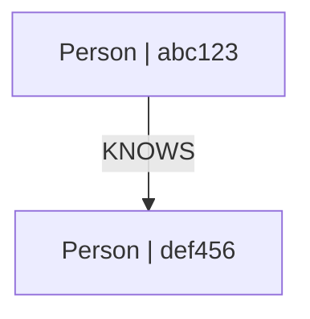

# GraphToMermaid

Export your graph to Mermaid flowchart syntax.

## Import

```typescript
import { GraphToMermaid } from 'grafio';
```

## fromGraph()

```typescript
static async fromGraph(graph: Graph, options?: MermaidOptions): Promise<GraphToMermaid>
```

Create a GraphToMermaid instance from a Graph.

**Parameters:**

| Name | Type | Required | Description |
|------|------|----------|-------------|
| `graph` | `Graph` | ✅ | Source graph |
| `options` | `MermaidOptions` | ❌ | Mermaid options |

## Constructor

```typescript
constructor(data: string | GraphData)
```

Create from JSON (synchronous).

**Parameters:**

| Name | Type | Required | Description |
|------|------|----------|-------------|
| `data` | `string \| GraphData` | ✅ | JSON string or GraphData object |

## toString()

```typescript
toString(): string
```

Returns the Mermaid flowchart definition.

## Options

```typescript
interface MermaidOptions {
  showProperties?: boolean;    // default: false
  includeEdgeLabels?: boolean; // default: true
  direction?: 'TD' | 'LR';     // default: 'TD'
}
```

## Examples

### Basic Usage

```typescript
import { Graph, GraphToMermaid } from 'grafio';

const graph = new Graph();
const alice = await graph.addNode('Person', { name: 'Alice' });
const bob = await graph.addNode('Person', { name: 'Bob' });
await graph.addEdge(alice.id, bob.id, 'KNOWS');

const mermaid = await GraphToMermaid.fromGraph(graph);
console.log(mermaid.toString());
```

**Output:**


### With Properties

```typescript
const mermaid = await GraphToMermaid.fromGraph(graph, {
  showProperties: true
});
/*
flowchart TD
    abc123["Person | name: Alice"]
    def456["Person | name: Bob"]
    abc123 -->|"KNOWS"| def456
*/
```

### Left-Right Direction

```typescript
const mermaid = await GraphToMermaid.fromGraph(graph, {
  direction: 'LR'
});
/*
flowchart LR
    ...
*/
```

### From JSON

```typescript
const json = await graph.exportJSON();
const mermaid = new GraphToMermaid(JSON.stringify(json));
// or
const mermaid2 = new GraphToMermaid(json);
```

## Rendering

Copy the output to:
- [Mermaid Live Editor](https://mermaid.live)
- Docusaurus markdown blocks
- VS Code Mermaid preview

## Next Steps

- [Visualization](../guides/visualization) — visualization guide
- [Serialization](../guides/serialization) — JSON export/import