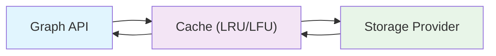

# Caching

Improve read performance with Grafio's pluggable caching layer.

## Overview



## Quick Start

```typescript
import { Graph, GraphManager, InMemoryStorageProvider } from 'grafio';

// 1. Initialize GraphManager with cache config
GraphManager.init({
  cache: {
    maxNodesCount: 10000,
    maxEdgesCount: 20000,
    cacheStore: 'in-memory',
    evictionStrategy: 'LRU',
    preloadStrategy: 'none',
  }
});

// 2. Create graph with caching
const graph = new Graph(new InMemoryStorageProvider());

// 3. Warm cache if needed
await graph.warmCache();
```

## Cache Configuration

### CacheConfig Options

| Option | Type | Default | Description |
|--------|------|---------|-------------|
| `maxNodesCount` | number | 10000 | Max nodes to cache |
| `maxEdgesCount` | number | 20000 | Max edges to cache |
| `cacheStore` | `'in-memory'` \| `'redis'` | `'in-memory'` | Cache backend |
| `evictionStrategy` | `'LRU'` \| `'LFU'` \| `'FIFO'` | `'LRU'` | Eviction algorithm |
| `preloadStrategy` | `'none'` \| `'all'` \| `'first-n'` | `'none'` | Preload strategy |
| `ttlSeconds` | number | 3600 | Redis TTL (if using Redis) |

### Eviction Strategies

| Strategy | Description |
|----------|-------------|
| `LRU` | Least Recently Used |
| `LFU` | Least Frequently Used |
| `FIFO` | First In, First Out |

### Preload Strategies

| Strategy | Description |
|----------|-------------|
| `'none'` | No preload (default) |
| `'all'` | Preload all nodes and edges |
| `'first-n'` | Preload first N items |

## Using Redis Cache

```typescript
import { GraphManager, RedisCache } from 'grafio';
import { RedisCache } from 'grafio/cache';

GraphManager.init({
  cache: {
    cacheStore: 'redis',
    maxNodesCount: 50000,
    maxEdgesCount: 100000,
    evictionStrategy: 'LRU',
    preloadStrategy: 'all',
    ttlSeconds: 7200,
  }
});
```

## Cache Statistics

Monitor cache performance:

```typescript
const stats = CacheManager.getStats(graphId);
// stats.hits, stats.misses, stats.size, etc.
```

## CacheManager API

```typescript
import { CacheManager, CacheStats } from 'grafio';

const stats: CacheStats = CacheManager.getStats(graphId);
console.log(`Hits: ${stats.hits}, Misses: ${stats.misses}`);
console.log(`Hit rate: ${stats.hitRate}%`);
console.log(`Nodes: ${stats.nodesCount}, Edges: ${stats.edgesCount}`);
```

## Performance Tips

1. **Set appropriate limits** — don't cache more than you need
2. **Use preload** — if startup time isn't critical, preload on warmCache()
3. **Choose right eviction** — LRU for temporal patterns, LFU for frequency
4. **Monitor hit rate** — aim for >80% hit rate

## Next Steps

- [Storage Providers](./storage-providers) — pluggable backends
- [API Reference](../api-reference/graph-manager) — GraphManager API
- [API Reference](../api-reference/cache-manager) — CacheManager API