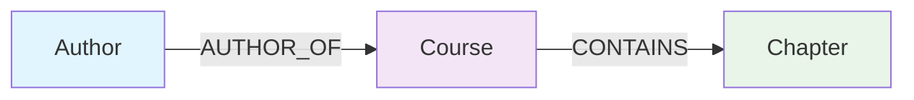

# Core Concepts

Understanding the fundamental building blocks of Grafio.

## Graph Structure

Grafio is a **directed graph** with:

- **Nodes** — typed entities with properties
- **Edges** — directed relationships between nodes
- **Types** — labels that categorize nodes and edges



## Nodes

Nodes are the primary entities in your graph.

### Creating Nodes

```typescript
const node = await graph.addNode('Person', { name: 'Alice', age: 30 });
```

### Node Properties

- `id` — unique identifier (auto-generated UUID)
- `type` — the type label (e.g., 'Person', 'Course')
- `properties` — key-value pairs (primitives only)

```typescript
node.id;          // 'uuid-xxxx-xxxx'
node.type;        // 'Person'
node.properties;  // { name: 'Alice', age: 30 }
```

### Supported Property Types

| Type | Examples |
|------|----------|
| String | `'hello'`, `'world'` |
| Number | `42`, `3.14` |
| Boolean | `true`, `false` |
| Null | `null`, `undefined` |

## Edges

Edges connect two nodes with a directed relationship.

### Creating Edges

```typescript
const edge = await graph.addEdge(sourceId, targetId, 'KNOWS', { since: 2020 });
```

### Edge Properties

- `id` — unique identifier
- `sourceId` — the starting node
- `targetId` — the ending node  
- `type` — relationship type (e.g., 'KNOWS', 'CONTAINS')
- `properties` — optional metadata

```typescript
edge.id;        // 'uuid-xxxx-xxxx'
edge.sourceId;  // source node id
edge.targetId;  // target node id
edge.type;      // 'KNOWS'
edge.properties; // { since: 2020 }
```

## Types

Types are string labels that categorize nodes and edges.

### Filtering by Type

Use `getNodes` with `filter` option or use Cypher queries:

```typescript
// Using GraphQueryOptions
const people = await graph.getNodes({ filter: { nodeType: 'Person' } });
```

```cypher
// Using Cypher
MATCH (p:Person) RETURN p.name
```

## Navigation

Use Cypher queries to navigate the graph.

### Get Outgoing Edges from a Node

```typescript
const result = await engine.query(`
  MATCH (source {id: $nodeId})-[r]->(target)
  RETURN type(r) AS edgeType, target.id AS targetId
`, { nodeId });
```

### Get Incoming Edges to a Node

```typescript
const result = await engine.query(`
  MATCH (source)-[r]->(target {id: $nodeId})
  RETURN type(r) AS edgeType, source.id AS sourceId
`, { nodeId });
```

### Get Edges Between Two Nodes

```typescript
const result = await engine.query(`
  MATCH (source {id: $sourceId})-[r]->(target {id: $targetId})
  RETURN r.id AS edgeId, type(r) AS edgeType
`, { sourceId, targetId });
```

### Filtering by Edge Type

```typescript
// Get only KNOWS edges from a node
const result = await engine.query(`
  MATCH (source {id: $nodeId})-[r:KNOWS]->(target)
  RETURN target.id AS targetId
`, { nodeId });
```

## Type Safety

Grafio uses TypeScript's type system for compile-time safety:

```typescript
import { InMemoryGraphFactory, Node, Edge } from 'grafio';

const factory = new InMemoryGraphFactory();
const graph = factory.forGraph('default');
const node: Node = await graph.addNode('Person', { name: 'Alice' });

// TypeScript knows node.id is a string
const id: string = node.id;
```

## Immutability

Node and edge properties are **deep-frozen** to prevent accidental mutation:

```typescript
const node = await graph.addNode('Person', { name: 'Alice' });
node.properties.name = 'Bob'; // TypeError: Cannot assign to read only property
```

## Next Steps

- [Graph Operations](./graph-operations) — CRUD operations on nodes and edges
- [Traversal](./traversal) — finding paths between nodes
- [Filtering](./filtering) — filtering by type and properties