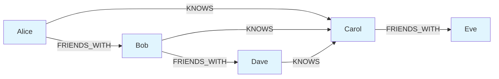
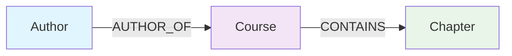

# Core Concepts

Understanding the fundamental building blocks of Grafio.

## Graph Concepts

A graph is a data structure consisting of **vertices** (also called nodes) connected by **edges** (also called links or relationships). Graphs model pairwise relationships between objects.

### Key Terms

- **Vertex (Node)** — An entity in the graph
- **Edge** — A connection between two vertices
- **Path** — A sequence of edges connecting two nodes

This social network shows how nodes (people) are connected through edges (relationships).

## Graph Types

### Directed Graph

In a directed graph, edges have a specific direction. An edge from node A to node B is not the same as an edge from node B to node A.

### Undirected Graph

In an undirected graph, edges have no direction. The relationship between two nodes is symmetric.

**Grafio uses a directed graph structure.**

## Graph Structure

Grafio is a **directed graph** with:

- **Nodes** — typed entities with properties
- **Edges** — directed relationships between nodes
- **Types** — labels that categorize nodes and edges

## Nodes

Nodes are the primary entities in your graph.

### Node Labels/Types

Nodes are categorized by labels (e.g., `Person`, `Course`, `Author`). A node can have multiple labels.

### Node Properties

- `id` — unique identifier (auto-generated UUID)
- `type` — the type label (e.g., 'Person', 'Course')
- `properties` — key-value pairs (primitives only)

### Supported Property Types

| Type | Description |
|------|-------------|
| String | Text values |
| Number | Integer or floating-point values |
| Boolean | `true` or `false` |
| Null | `null` or `undefined` |

## Edges

Edges connect two nodes with a directed relationship.

### Edge Types

Edges are categorized by relationship types (e.g., `KNOWS`, `AUTHOR_OF`, `CONTAINS`). An edge type defines the nature of the relationship.

### Edge Properties

- `id` — unique identifier
- `sourceId` — the starting node
- `targetId` — the ending node  
- `type` — relationship type (e.g., 'KNOWS', 'CONTAINS')
- `properties` — optional metadata

## Type Safety

Grafio uses TypeScript's type system for compile-time safety. All nodes and edges are strongly typed, and the API is designed to catch errors at compile time rather than runtime.

## Immutability

Node and edge properties are **deep-frozen** to prevent accidental mutation. Once a node or edge is created, its properties cannot be modified.

## Next Steps

- [Querying Graph](./querying-graph) — navigate and query the graph with Cypher
- [Data Operations](./data-operations) — create and manipulate nodes and edges
- [Filtering](./filtering) — filter by type and properties