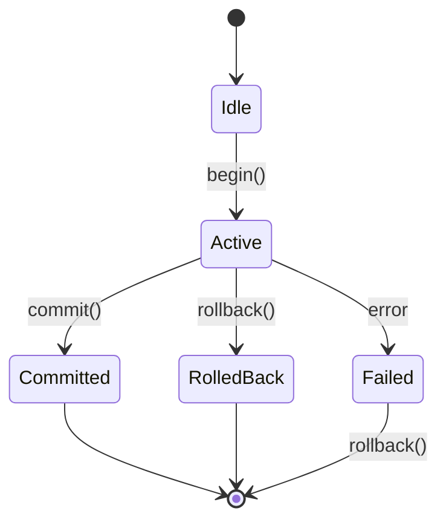

# Transactions

Batch multiple operations into a single atomic unit using Cypher.

## Setup

```typescript
import { InMemoryGraphFactory } from 'grafio';
import { CypherEngine } from 'grafio/cypher';

const factory = new InMemoryGraphFactory();
const graph = factory.forGraph('default');
const engine = new CypherEngine(graph);
```

## Transaction Lifecycle



## Basic Usage

```typescript
const txn = graph.createTransaction();

await txn.begin();

try {
await engine.execute(
  `CREATE (p:Person {name: 'Alice', age: 30})`,
  {},
  { transaction: txn }
);

await engine.execute(
  `CREATE (p:Person {name: 'Bob', age: 25})`,
  {},
  { transaction: txn }
);
  
  await txn.commit();
} catch (error) {
  if (txn.isActive()) {
    await txn.rollback();
  }
  throw error;
}
```

## Transaction Methods

| Method | Description |
|--------|-------------|
| `begin()` | Start a new transaction |
| `commit()` | Apply all changes atomically |
| `rollback()` | Discard all changes |
| `isActive()` | Check if transaction is active |
| `isFailed()` | Check if transaction failed |

## With Cypher Queries

Pass the transaction via `CypherEngineOptions.transaction` for consistent reads:

```typescript
const txn = graph.createTransaction();
await txn.begin();

await engine.execute(
  `CREATE (p:Person {name: 'Alice'})`,
  {},
  { transaction: txn }
);

// Read uncommitted data via Cypher query
const result = await engine.execute(
  'MATCH (p:Person) RETURN p.name AS name',
  {},
  { transaction: txn }
);
console.log(result.rows);  // includes Alice
```

## Automatic Rollback

If `commit()` fails, the transaction is automatically marked as failed:

```typescript
const txn = graph.createTransaction();
await txn.begin();

try {
  // ... operations ...
  await txn.commit();
} catch (error) {
  // txn.isFailed() === true
  // txn.isActive() === false
  // Explicit rollback not needed on commit failure
}
```

## Atomic Data Operations

All data operations can be batched in a transaction:

```typescript
async function createUserWithFriends(engine, graph, userName: string, friendNames: string[]) {
  const txn = graph.createTransaction();
  await txn.begin();
  
  try {
    // Create user
    await engine.execute(
      `CREATE (u:User {name: $name})`,
      { name: userName },
      { transaction: txn }
    );
    
    // Create friends and relationships
    for (const friendName of friendNames) {
      await engine.execute(
        `MATCH (u:User {name: $userName})
         CREATE (f:User {name: $friendName})
         CREATE (u)-[:KNOWS]->(f)`,
        { userName, friendName },
        { transaction: txn }
      );
    }
    
    await txn.commit();
  } catch (error) {
    if (txn.isActive()) {
      await txn.rollback();
    }
    throw error;
  }
}
```

## Best Practices

```typescript
// ✅ Good: explicit rollback on failure
const txn = graph.createTransaction();
await txn.begin();
try {
await engine.execute(`CREATE (n:Test)`, {}, { transaction: txn });
await txn.commit();
} catch {
  if (txn.isActive()) await txn.rollback();
  throw;
}

// ❌ Bad: missing rollback
try {
  const txn = graph.createTransaction();
  await txn.begin();
  // ... work ...
  await txn.commit();
} catch { /* no rollback! */ }
```

## Next Steps

- [Caching](./caching) — cache configuration
- [API Reference](../api-reference/graph-transaction) — transaction API