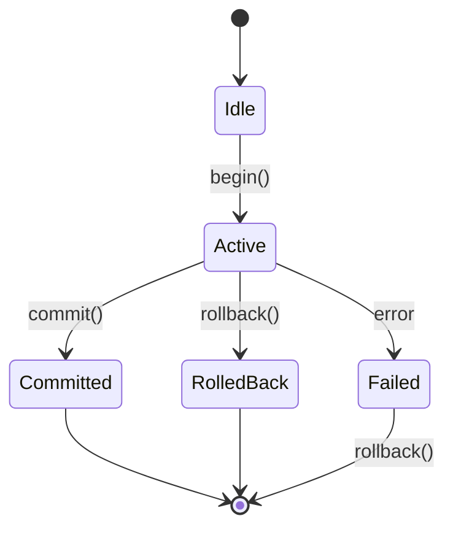

# Transactions

Batch multiple operations into a single atomic unit.

## Transaction Lifecycle



## Basic Usage

```typescript
import { InMemoryGraphFactory } from 'grafio';

const factory = new InMemoryGraphFactory();
const graph = factory.forGraph('default');
const txn = graph.createTransaction();

await txn.begin();

try {
  const alice = await graph.addNode('Person', { name: 'Alice' }, txn);
  const bob = await graph.addNode('Person', { name: 'Bob' }, txn);
  await graph.addEdge(alice.id, bob.id, 'KNOWS', {}, txn);
  
  await txn.commit();
} catch (error) {
  if (txn.isActive()) {
    await txn.rollback();
  }
  throw error;
}
```

## Transaction Methods

| Method | Description |
|--------|-------------|
| `begin()` | Start a new transaction |
| `commit()` | Apply all changes atomically |
| `rollback()` | Discard all changes |
| `isActive()` | Check if transaction is active |
| `isFailed()` | Check if transaction failed |

## Transaction-Aware Queries

Use Cypher queries with transaction support for consistent reads:

```typescript
import { CypherEngine } from 'grafio/cypher';

const engine = new CypherEngine(graph);
const txn = graph.createTransaction();
await txn.begin();

await graph.addNode('Person', { name: 'Alice' }, txn);

// Read uncommitted data via Cypher query with transaction
const result = await engine.execute(
  'MATCH (p:Person) RETURN p.name AS name, p.id AS id',
  { transaction: txn }  // Pass transaction via CypherEngineOptions
);
console.log(result.rows);  // includes Alice
```

## Automatic Rollback

If `commit()` fails, the transaction is automatically marked as failed:

```typescript
const txn = graph.createTransaction();
await txn.begin();

try {
  // ... operations ...
  await txn.commit();
} catch (error) {
  // txn.isFailed() === true
  // txn.isActive() === false
  // Explicit rollback not needed on commit failure
}
```

## Nested Operations

All Graph methods accept an optional transaction parameter:

```typescript
await graph.addNode(type, properties, txn);
await graph.addEdge(sourceId, targetId, type, properties, txn);
await graph.getNodes(txn);
await graph.traverse(sourceId, targetId, options, txn);
```

## Best Practices

```typescript
// ✅ Good: explicit rollback on failure
const txn = graph.createTransaction();
await txn.begin();
try {
  // ... work ...
  await txn.commit();
} catch {
  if (txn.isActive()) await txn.rollback();
  throw;
}

// ❌ Bad: missing rollback
try {
  const txn = graph.createTransaction();
  await txn.begin();
  // ... work ...
  await txn.commit();
} catch { /* no rollback! */ }
```

## Next Steps

- [Caching](./caching) — cache configuration
- [API Reference](../api-reference/graph-transaction) — transaction API
- [Graph Operations](./graph-operations) — CRUD operations