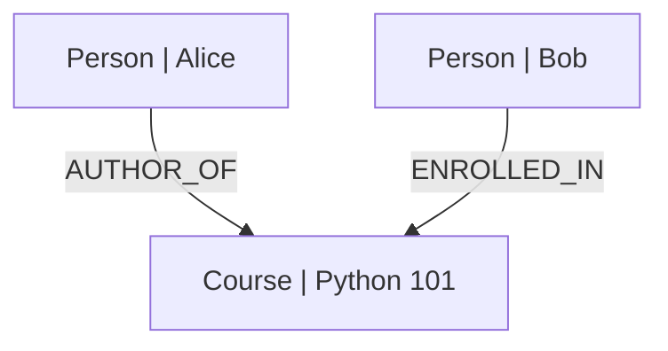
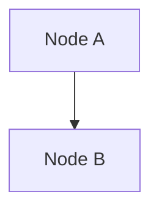

# Visualization

Export your graph to Mermaid diagrams for visualization.

## Quick Start

```typescript
import { InMemoryGraphFactory, GraphToMermaid } from 'grafio';

const factory = new InMemoryGraphFactory();
const graph = factory.forGraph('default');
// ... add nodes and edges ...

const mermaid = await GraphToMermaid.fromGraph(graph);
console.log(mermaid.toString());
```

## Output Example



## Options

```typescript
interface MermaidOptions {
  showProperties?: boolean;    // default: false
  includeEdgeLabels?: boolean; // default: true
  direction?: 'TD' | 'LR';     // default: 'TD'
}
```

### Show Properties

```typescript
const mermaid = await GraphToMermaid.fromGraph(graph, {
  showProperties: true
});
/*
flowchart TD
    abc123["Person | name: Alice | age: 30"]
*/
```

### Flowchart Direction

```typescript
// Top-down (default)
const td = await GraphToMermaid.fromGraph(graph, { direction: 'TD' });

// Left-right
const lr = await GraphToMermaid.fromGraph(graph, { direction: 'LR' });
```

## Using with Serialized Data

```typescript
// From JSON (synchronous)
const json = await graph.exportJSON();
const mermaid = new GraphToMermaid(JSON.stringify(json));
// or
const mermaid2 = new GraphToMermaid(json);
```

## Rendering Mermaid

### Mermaid Live Editor

Copy the output and paste into [Mermaid Live Editor](https://mermaid.live).

### Docusaurus Integration

Docusaurus supports Mermaid out of the box:

````markdown

````

### VS Code Extension

Install the [Mermaid Markdown Preview](https://marketplace.visualstudio.com/items?itemName=bierner.markdown-mermaid) extension.

## Common Patterns

### Social Network

```typescript
// People and their connections
const alice = await graph.addNode('Person', { name: 'Alice' });
const bob = await graph.addNode('Person', { name: 'Bob' });
const carol = await graph.addNode('Person', { name: 'Carol' });

await graph.addEdge(alice.id, bob.id, 'KNOWS');
await graph.addEdge(bob.id, carol.id, 'KNOWS');
await graph.addEdge(alice.id, carol.id, 'FRIEND_OF');
```

### Hierarchical Data

```typescript
// Organization chart
const ceo = await graph.addNode('Employee', { name: 'CEO' });
const vp1 = await graph.addNode('Employee', { name: 'VP Engineering' });
const vp2 = await graph.addNode('Employee', { name: 'VP Sales' });

await graph.addEdge(ceo.id, vp1.id, 'MANAGES');
await graph.addEdge(ceo.id, vp2.id, 'MANAGES');
```

### Course Structure

```typescript
const course = await graph.addNode('Course', { title: 'CS101' });
const ch1 = await graph.addNode('Chapter', { title: 'Intro' });
const ch2 = await graph.addNode('Chapter', { title: 'Advanced' });

await graph.addEdge(course.id, ch1.id, 'CONTAINS');
await graph.addEdge(course.id, ch2.id, 'CONTAINS');
```

## Next Steps

- [Serialization](./serialization) — JSON export/import
- [Core Concepts](./core-concepts) — graph data model
- [API Reference](../api-reference/graph-to-mermaid) — full API